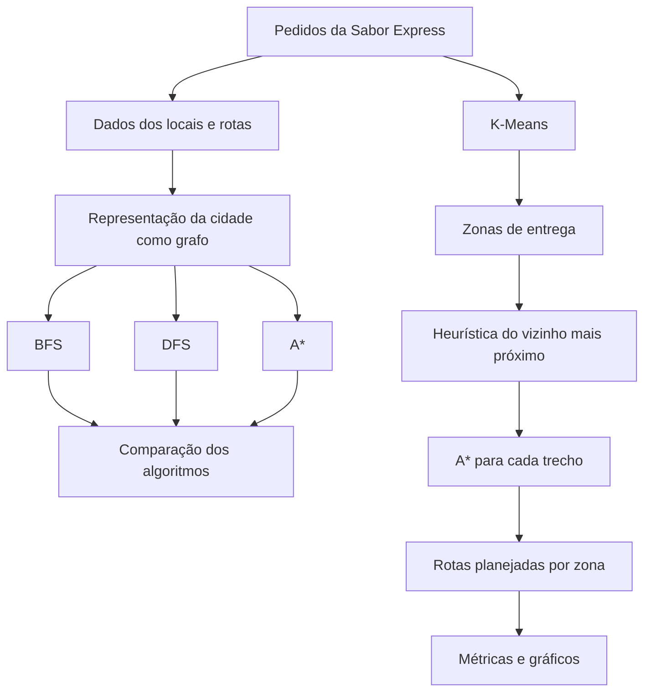

# Rota Inteligente: Otimização de Entregas com Algoritmos de IA

Projeto desenvolvido para a disciplina **Artificial Intelligence Fundamentals**, com o objetivo de aplicar conceitos de Inteligência Artificial na otimização de entregas de uma empresa fictícia chamada **Sabor Express**.

A solução utiliza representação por grafos, algoritmos de busca, heurísticas e aprendizado de máquina não supervisionado para organizar pedidos em regiões e calcular rotas de entrega.

---

## 1. Descrição do problema

A Sabor Express é uma pequena empresa de delivery de alimentos que atende diferentes regiões da cidade.

Durante períodos de maior demanda, como almoço e jantar, os entregadores precisam realizar diversas entregas em locais diferentes. Quando as rotas são definidas apenas pela experiência do entregador, podem ocorrer:

- trajetos desnecessariamente longos;
- aumento no tempo de entrega;
- maior consumo de combustível;
- dificuldade para organizar muitos pedidos;
- atraso nas entregas;
- redução da satisfação dos clientes.

O problema proposto consiste em desenvolver uma solução capaz de representar a cidade como um grafo e utilizar técnicas de Inteligência Artificial para auxiliar na escolha das rotas.

---

## 2. Objetivos

O objetivo principal do projeto é desenvolver uma solução computacional capaz de apoiar o planejamento de entregas da Sabor Express.

Os objetivos específicos são:

- representar a cidade como um grafo;
- representar locais como vértices;
- representar caminhos entre locais como arestas;
- utilizar distância e tempo como informações das rotas;
- implementar e comparar BFS, DFS e A*;
- utilizar uma heurística para orientar a busca do A*;
- agrupar entregas próximas utilizando K-Means;
- dividir os pedidos em zonas de entrega;
- planejar uma sequência de entregas para cada zona;
- considerar possíveis restrições urbanas;
- gerar métricas e gráficos para avaliar os resultados.

---

## 3. Visão geral da solução

A solução foi organizada no seguinte fluxo:



A implementação combina diferentes técnicas porque cada uma resolve uma parte específica do problema.

O **K-Means** é utilizado para organizar pedidos próximos em regiões.

Depois, uma heurística de **vizinho mais próximo** define a sequência aproximada das entregas dentro de cada região.

Por fim, o **A\*** calcula o caminho entre os pontos utilizando o grafo da cidade.

---

## 4. Tecnologias utilizadas

O projeto foi desenvolvido em Python.

Principais bibliotecas utilizadas:

- **pandas**: leitura e manipulação dos arquivos CSV;
- **matplotlib**: geração dos gráficos;
- **scikit-learn**: implementação do K-Means;
- **networkx**: visualização do grafo;
- **unittest**: testes automatizados;
- bibliotecas nativas do Python, como `heapq`, `math`, `collections` e `time`.

---

## 5. Estrutura do projeto

```text
rota-inteligente-ia/
│
├── README.md
├── requirements.txt
├── .gitignore
│
├── data/
│   ├── locais.csv
│   ├── rotas.csv
│   └── entregas.csv
│
├── src/
│   ├── main.py
│   ├── grafo.py
│   ├── bfs.py
│   ├── dfs.py
│   ├── astar.py
│   ├── clustering.py
│   ├── planejamento.py
│   ├── metricas.py
│   └── gerar_outputs.py
│
├── tests/
│   └── test_sistema.py
│
├── outputs/
│   ├── grafo_cidade.png
│   ├── clusters.png
│   ├── comparacao_algoritmos.png
│   └── rotas_por_zona.png
│
└── docs/
```

---

# 6. Representação da cidade utilizando grafos

A cidade foi representada como um **grafo não direcionado e ponderado**.

No modelo:

- cada **vértice** representa um local;
- cada **aresta** representa uma ligação possível entre dois locais;
- o peso principal utilizado na busca representa a distância em quilômetros;
- também é armazenado o tempo estimado de cada ligação.

O cenário criado possui:

- **13 vértices**;
- **24 arestas**;
- **1 restaurante**;
- **12 locais de entrega**.

O restaurante Sabor Express é representado pelo vértice de ID `0`.

## Lista de adjacência

A implementação utiliza uma **lista de adjacência**.

Para cada vértice são armazenados seus vizinhos e as informações da ligação.

Exemplo simplificado:

```text
Sabor Express
├── Centro: 2.0 km
├── Bela Vista: 3.0 km
├── Santa Clara: 3.0 km
├── Jardim das Flores: 2.8 km
└── Vila Verde: 2.8 km
```

Essa representação permite percorrer os vizinhos de cada local de maneira simples durante os algoritmos de busca.

## Visualização do grafo


---

# 7. Busca em Largura — BFS

A **Busca em Largura**, ou Breadth-First Search, explora o grafo por níveis.

O algoritmo utiliza uma fila e visita primeiro os vizinhos mais próximos em quantidade de arestas antes de avançar para os próximos níveis.

No projeto, o BFS foi implementado manualmente utilizando `deque`.

Fluxo simplificado:

```text
Vértice inicial
      ↓
Visita seus vizinhos
      ↓
Adiciona novos vértices à fila
      ↓
Continua nível por nível
      ↓
Encontra o objetivo
```

Uma característica importante é que BFS encontra o caminho com menor quantidade de arestas em um grafo não ponderado.

No projeto, entretanto, as arestas possuem pesos. Portanto, o BFS é utilizado principalmente como referência para comparação e não como solução definitiva de otimização por distância.

---

# 8. Busca em Profundidade — DFS

A **Busca em Profundidade**, ou Depth-First Search, tenta avançar o máximo possível por um ramo antes de voltar e explorar outro caminho.

A implementação utiliza recursão e realiza o processo de backtracking quando necessário.

Fluxo simplificado:

```text
Vértice inicial
      ↓
Escolhe um vizinho
      ↓
Continua aprofundando
      ↓
Sem novos vizinhos
      ↓
Backtracking
      ↓
Explora outro ramo
```

O DFS é capaz de encontrar um caminho entre origem e destino, mas não tem como objetivo encontrar o menor caminho.

Isso ficou evidente nos resultados obtidos no projeto.

---

# 9. Algoritmo A*

O **A\*** é o principal algoritmo utilizado para cálculo das rotas no projeto.

Ele é uma busca informada que combina:

```text
f(n) = g(n) + h(n)
```

onde:

- `g(n)` representa o custo real acumulado até o vértice atual;
- `h(n)` representa uma estimativa do custo restante até o objetivo;
- `f(n)` representa o custo total estimado.

Essa combinação permite direcionar a busca para regiões mais promissoras do grafo.

## Heurística utilizada

A heurística utilizada no projeto é baseada na distância Euclidiana entre as coordenadas dos pontos:

```text
h(n) = √((x1 - x2)² + (y1 - y2)²)
```

Como as coordenadas utilizadas são fictícias e não representam diretamente quilômetros, foi aplicado um fator conservador de `0.9`:

```text
h(n) = distância_euclidiana × 0.9
```

O objetivo é evitar uma estimativa excessivamente alta em relação aos pesos definidos para as arestas do cenário.

---

# 10. Comparação entre BFS, DFS e A*

Foi realizado um teste utilizando:

```text
Origem: Sabor Express
Destino: Parque Industrial
```

Os resultados encontrados foram:

| Algoritmo | Conexões | Distância | Vértices analisados |
|---|---:|---:|---:|
| BFS | 2 | 5,6 km | 12 |
| DFS | 9 | 22,6 km | 12 |
| A* | 2 | 5,6 km | 4 |

O BFS encontrou:

```text
Sabor Express
→ Jardim das Flores
→ Parque Industrial
```

Distância total:

```text
5,6 km
```

O DFS encontrou um caminho consideravelmente maior, com:

```text
9 conexões
22,6 km
```

O A* encontrou novamente a rota de:

```text
5,6 km
```

porém analisando apenas:

```text
4 vértices
```

contra:

```text
12 vértices
```

analisados pelo BFS e pelo DFS nesse cenário.

Isso demonstra que a heurística conseguiu direcionar a busca para uma região mais promissora do grafo.

O tempo de execução também é medido pela aplicação, porém não foi utilizado isoladamente para afirmar que um algoritmo é superior ao outro. Como o grafo possui apenas 13 vértices, os tempos são muito pequenos e podem variar entre execuções.

## Comparação visual


---

# 11. Agrupamento das entregas com K-Means

Quando existem muitos pedidos, calcular uma única sequência de entregas pode se tornar mais difícil.

Para organizar os pedidos, foi utilizado o algoritmo **K-Means**, uma técnica de clustering.

O algoritmo recebe as coordenadas `(x, y)` de cada local de entrega e tenta organizar os pontos em grupos de proximidade.

Neste projeto foi definido:

```text
K = 3
```

Portanto, as 12 entregas foram separadas em três zonas.

## Zona 1

Centroide:

```text
(6.80, 7.40)
```

Locais:

- Centro;
- Jardim Sul;
- Santa Clara;
- Parque Norte;
- Vila Leste.

## Zona 2

Centroide:

```text
(2.25, 5.75)
```

Locais:

- Vila Nova;
- Bela Vista;
- Jardim Oeste;
- Jardim das Flores.

## Zona 3

Centroide:

```text
(7.00, 2.33)
```

Locais:

- Vila Verde;
- Parque Industrial;
- Lago Azul.

## Visualização dos clusters


---

# 12. Planejamento das rotas por zona

Após o agrupamento, cada zona precisa ter sua própria sequência de entregas.

Foi utilizada uma estratégia heurística baseada no **vizinho mais próximo**.

A lógica é:

1. iniciar no restaurante;
2. identificar a entrega ainda não realizada mais próxima da posição atual;
3. selecionar esse local como próximo destino;
4. utilizar A* para encontrar o caminho até ele;
5. remover o local da lista de entregas pendentes;
6. repetir o processo até concluir a zona.

É importante destacar que a distância Euclidiana é usada apenas para selecionar o próximo destino.

O caminho real entre dois pontos é calculado utilizando **A\*** sobre o grafo.

---

## Resultado da Zona 1

Ordem planejada:

```text
Sabor Express
→ Centro
→ Jardim Sul
→ Vila Leste
→ Santa Clara
→ Parque Norte
```

Distância total:

```text
14,4 km
```

---

## Resultado da Zona 2

Ordem planejada:

```text
Sabor Express
→ Jardim das Flores
→ Bela Vista
→ Jardim Oeste
→ Vila Nova
```

Distância total:

```text
9,7 km
```

---

## Resultado da Zona 3

Ordem planejada:

```text
Sabor Express
→ Vila Verde
→ Lago Azul
→ Parque Industrial
```

Distância total:

```text
9,6 km
```

---

## Distância consolidada

Somando as três zonas:

```text
14,4 + 9,7 + 9,6 = 33,7 km
```

Portanto:

```text
Distância total planejada = 33,7 km
```

## Visualização


---

# 13. Restrições urbanas

A solução também possui suporte para simular uma restrição urbana.

Uma aresta do grafo pode ser temporariamente removida para representar situações como:

- obras;
- acidentes;
- vias interditadas;
- restrições temporárias de circulação.

Durante os testes foi bloqueada a ligação:

```text
Sabor Express
↔ Jardim das Flores
```

Sem essa ligação, o A* foi capaz de calcular uma rota alternativa:

```text
Sabor Express
→ Vila Verde
→ Parque Industrial
```

mantendo uma distância total de:

```text
5,6 km
```

Isso demonstra que a busca não depende de um único caminho fixo e pode se adaptar a alterações na estrutura do grafo.

---

# 14. Testes automatizados

O projeto possui testes automatizados utilizando a biblioteca `unittest`.

Atualmente são executados **8 testes**:

1. validação da quantidade de dados;
2. validação do BFS;
3. validação do DFS;
4. validação da rota encontrada pelo A*;
5. validação de uma restrição urbana;
6. validação da criação de três clusters pelo K-Means;
7. validação de que todas as entregas entram no planejamento;
8. validação da distância total das zonas.

Resultado obtido:

```text
Ran 8 tests

OK
```

Isso confirma que todas as validações implementadas foram executadas com sucesso.

---

# 15. Análise dos resultados

A solução mostrou que diferentes algoritmos apresentam comportamentos bastante distintos mesmo utilizando o mesmo grafo.

O BFS foi eficiente para encontrar uma rota com poucas conexões, porém precisou explorar mais vértices.

O DFS encontrou um caminho válido, mas o percurso resultante foi significativamente maior.

O A* apresentou o resultado mais adequado para o objetivo do projeto porque considera os custos das arestas e utiliza uma heurística para orientar a exploração.

No cenário analisado, BFS e A* encontraram uma rota de 5,6 km. Entretanto, o A* analisou apenas 4 vértices, enquanto o BFS analisou 12.

O K-Means também contribuiu para a solução ao dividir as entregas em zonas geograficamente próximas.

Essa divisão permite tratar conjuntos menores de pedidos e simular a distribuição das regiões entre diferentes entregadores.

A solução final combina:

```text
Grafo
+
K-Means
+
Vizinho mais próximo
+
A*
```

permitindo organizar pedidos e encontrar caminhos de maneira automatizada.

---

# 16. Eficiência da solução

Para o cenário utilizado, a solução apresentou bons resultados.

O A* reduziu o número de vértices explorados no teste realizado:

```text
BFS = 12 vértices
DFS = 12 vértices
A*  = 4 vértices
```

O agrupamento também reduziu o problema logístico em conjuntos menores:

```text
12 entregas
↓
3 zonas
```

Cada zona pôde então ser planejada separadamente.

Essa abordagem pode ser particularmente útil quando diferentes entregadores são responsáveis por regiões diferentes.

---

# 17. Limitações

Apesar dos resultados obtidos, a solução possui algumas limitações.

## Dados fictícios

As coordenadas e distâncias utilizadas foram criadas para fins acadêmicos e não representam uma cidade real.

## Quantidade fixa de clusters

Foi utilizado:

```text
K = 3
```

A quantidade ideal de zonas não é calculada automaticamente.

## Vizinho mais próximo

A estratégia de selecionar sempre o próximo ponto mais próximo é uma heurística.

Ela produz uma solução simples e eficiente, porém não garante que a sequência completa seja a melhor rota global possível.

## Trânsito não dinâmico

Os pesos das arestas são fixos.

A aplicação não recebe informações em tempo real sobre:

- congestionamentos;
- acidentes;
- clima;
- alterações no tempo estimado.

## Capacidade dos entregadores

Não foram consideradas restrições como:

- quantidade máxima de pedidos;
- capacidade do veículo;
- peso da carga;
- horário de entrega;
- jornada do entregador.

## Retorno ao restaurante

O planejamento atual inicia cada zona na Sabor Express, mas não exige que o entregador retorne ao restaurante após a última entrega.

---

# 18. Possíveis melhorias futuras

Entre as principais evoluções possíveis estão:

- utilizar latitude e longitude reais;
- integrar mapas reais;
- considerar dados de trânsito em tempo real;
- calcular automaticamente a melhor quantidade de clusters;
- utilizar métricas como Silhouette Score para avaliar os grupos;
- implementar janelas de horário para as entregas;
- considerar capacidade máxima de cada entregador;
- considerar múltiplos restaurantes;
- obrigar o retorno ao ponto de origem;
- comparar A* com Dijkstra;
- implementar problemas de Vehicle Routing Problem (VRP);
- utilizar programação linear inteira;
- comparar a heurística de vizinho mais próximo com algoritmos genéticos ou outras metaheurísticas;
- utilizar dados históricos para estimar tempos reais de deslocamento.

---

# 19. Como executar o projeto

## 19.1 Criar o ambiente virtual

No Windows:

```bash
python -m venv .venv
```

Ativar:

```bash
.venv\Scripts\activate
```

---

## 19.2 Instalar as dependências

```bash
pip install -r requirements.txt
```

---

## 19.3 Executar a aplicação

```bash
python src/main.py
```

A aplicação exibirá:

- dados carregados;
- resultados de BFS;
- resultados de DFS;
- resultados de A*;
- comparação entre os algoritmos;
- agrupamento K-Means;
- planejamento das rotas por zona.

---

## 19.4 Executar os testes automatizados

```bash
python -m unittest discover -s tests -v
```

Resultado esperado:

```text
Ran 8 tests
OK
```

---

## 19.5 Gerar os gráficos

```bash
python src/gerar_outputs.py
```

Os arquivos serão gravados na pasta:

```text
outputs/
```

---

# 20. Arquivos de dados

## `data/locais.csv`

Contém:

- ID;
- nome do local;
- coordenada X;
- coordenada Y;
- tipo do local.

## `data/rotas.csv`

Contém:

- origem;
- destino;
- distância em quilômetros;
- tempo estimado em minutos.

## `data/entregas.csv`

Contém:

- ID do pedido;
- local de entrega;
- cliente;
- prioridade.

---

# 21. Conclusão

O projeto demonstrou como diferentes técnicas de Inteligência Artificial podem ser combinadas para resolver um problema de logística.

A representação da cidade por grafos permitiu aplicar algoritmos clássicos de busca.

A comparação entre BFS, DFS e A* mostrou diferenças importantes entre buscas não informadas e uma busca orientada por heurística.

O A* apresentou uma boa relação entre qualidade da rota e quantidade de vértices explorados no cenário desenvolvido.

O K-Means permitiu organizar os pedidos em regiões de proximidade, enquanto a estratégia de vizinho mais próximo e o A* foram utilizados em conjunto para criar rotas para cada zona.

Além disso, a implementação de restrições urbanas mostrou que a solução pode recalcular caminhos quando uma ligação não está disponível.

Com isso, o projeto apresenta uma solução funcional e extensível para o problema proposto pela Sabor Express, demonstrando conceitos de grafos, busca, heurísticas, clustering e otimização aplicados a um cenário prático.

---

# 22. Referências

- Material da disciplina **Artificial Intelligence Fundamentals — Unidade I**.
- Material da disciplina **Artificial Intelligence Fundamentals — Unidade II**.
- Estudo de caso **UPS — ORION**, sugerido no enunciado do trabalho.
- Conteúdos e estudos de caso sobre otimização de rotas e clustering sugeridos nas orientações da atividade.