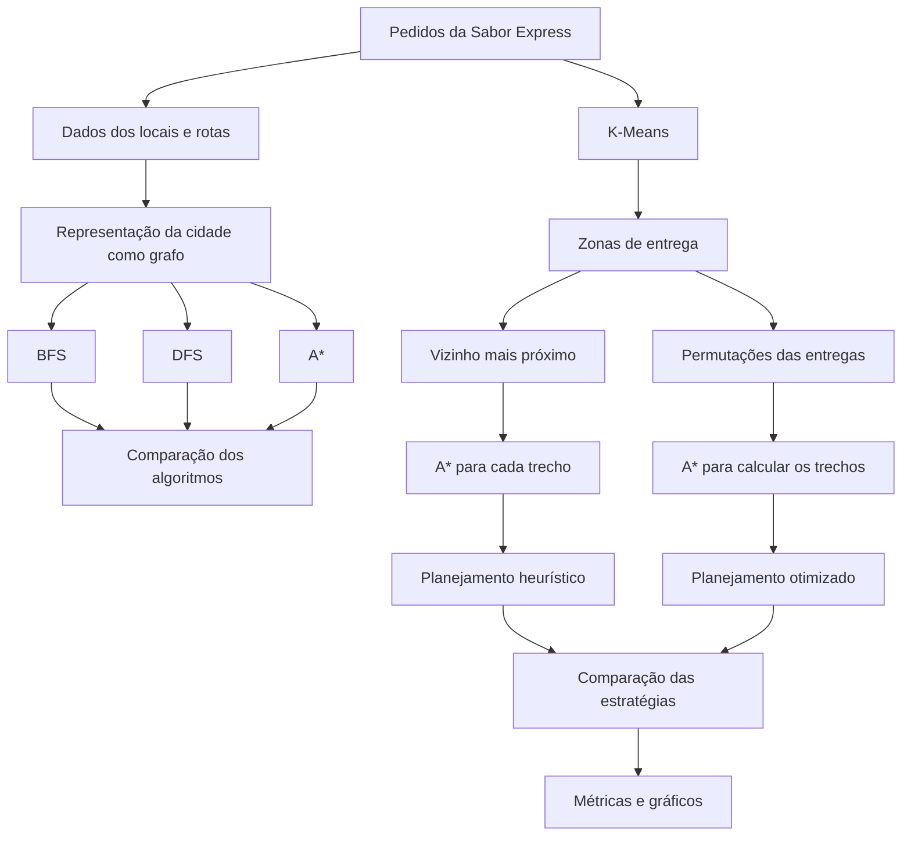
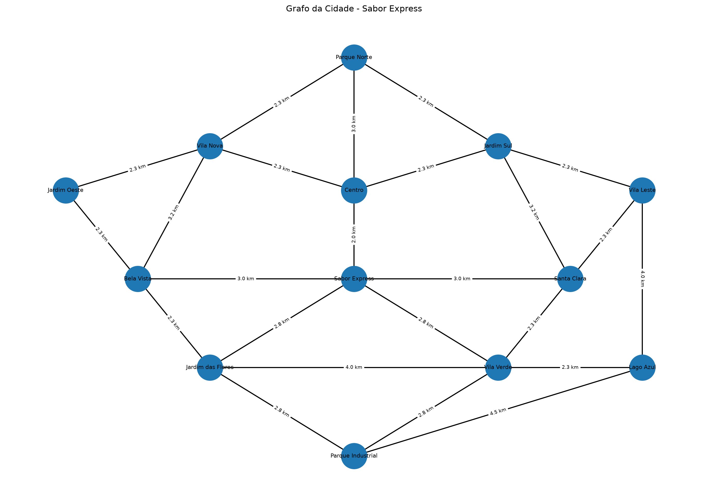
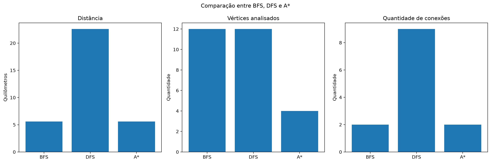
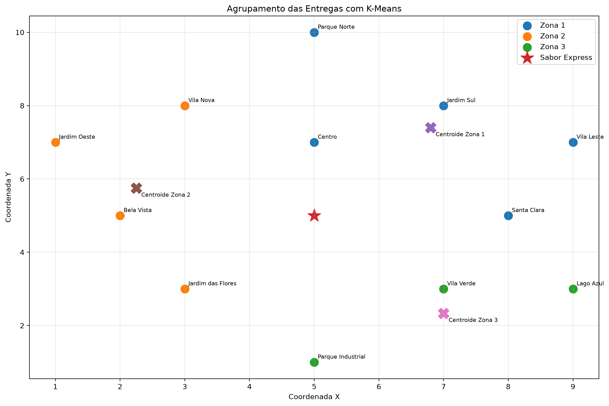
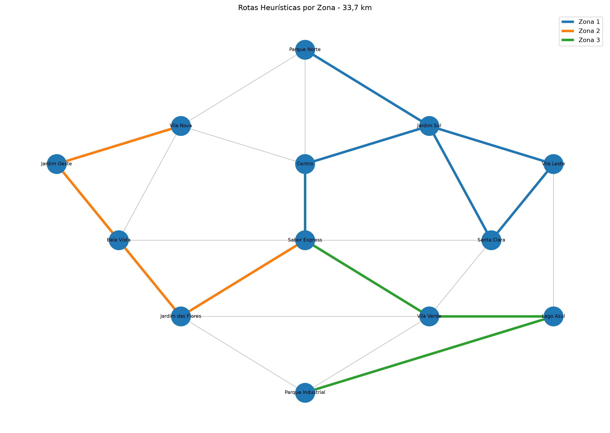
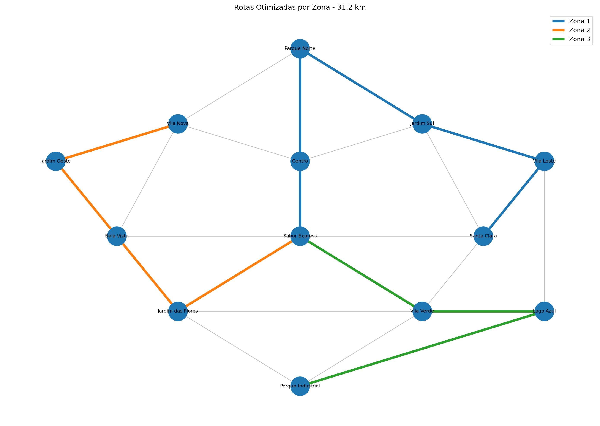
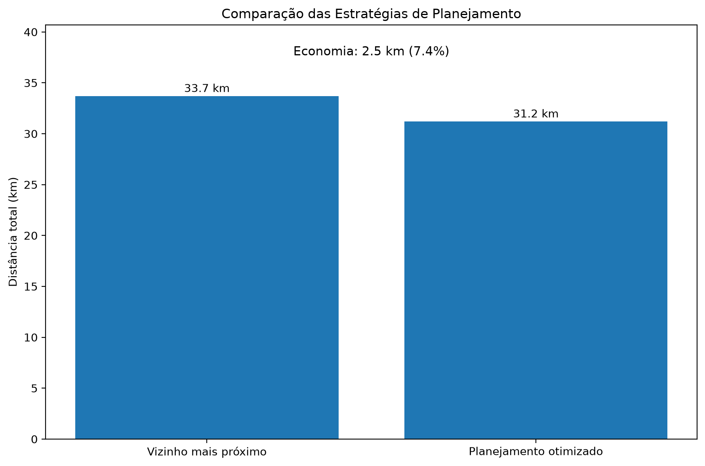

# Rota Inteligente: Otimização de Entregas com Algoritmos de IA

Projeto desenvolvido para a disciplina **Artificial Intelligence Fundamentals**, com o objetivo de aplicar conceitos de Inteligência Artificial na otimização de entregas de uma empresa fictícia chamada **Sabor Express**.

A solução utiliza representação por grafos, algoritmos de busca, heurísticas e aprendizado de máquina não supervisionado para organizar pedidos em regiões e calcular rotas de entrega.

---

## 1. Descrição do problema

A Sabor Express é uma pequena empresa de delivery de alimentos que atende diferentes regiões da cidade.

Durante períodos de maior demanda, como almoço e jantar, os entregadores precisam realizar diversas entregas em locais diferentes.

Quando as rotas são definidas apenas pela experiência do entregador, podem ocorrer:

- trajetos desnecessariamente longos;
- aumento no tempo de entrega;
- maior consumo de combustível;
- dificuldade para organizar muitos pedidos;
- atraso nas entregas;
- redução da satisfação dos clientes.

O problema proposto consiste em desenvolver uma solução capaz de representar a cidade como um grafo e utilizar técnicas de Inteligência Artificial para auxiliar na escolha das melhores rotas para múltiplos pontos de entrega.

---

## 2. Objetivos

O objetivo principal do projeto é desenvolver uma solução computacional capaz de apoiar o planejamento de entregas da Sabor Express.

Os objetivos específicos são:

- representar a cidade como um grafo;
- representar locais como vértices;
- representar caminhos entre locais como arestas;
- utilizar distância e tempo como informações das rotas;
- implementar e comparar BFS, DFS e A*;
- utilizar uma heurística para orientar a busca do A*;
- agrupar entregas próximas utilizando K-Means;
- dividir os pedidos em zonas de entrega;
- planejar uma sequência de entregas para cada zona;
- comparar uma estratégia heurística com uma estratégia otimizada;
- encontrar a melhor ordem de atendimento dentro de cada zona;
- considerar possíveis restrições urbanas;
- gerar métricas e gráficos para avaliar os resultados.

---

## 3. Visão geral da solução

A solução foi organizada no seguinte fluxo:



A implementação combina diferentes técnicas porque cada uma resolve uma parte específica do problema.

O **K-Means** organiza pedidos geograficamente próximos em zonas.

Depois são avaliadas duas estratégias de planejamento:

1. uma solução heurística baseada no **vizinho mais próximo**;
2. uma solução otimizada que testa todas as ordens possíveis de atendimento dentro de cada zona.

Nos dois casos, o **A*** é utilizado para calcular o caminho real entre os pontos no grafo.

---

## 4. Tecnologias utilizadas

O projeto foi desenvolvido em Python.

Principais bibliotecas utilizadas:

- **pandas**: leitura e manipulação dos arquivos CSV;
- **matplotlib**: geração dos gráficos;
- **scikit-learn**: implementação do K-Means;
- **networkx**: visualização do grafo;
- **unittest**: testes automatizados;
- bibliotecas nativas do Python, como `heapq`, `math`, `itertools`, `collections` e `time`.

---

## 5. Estrutura do projeto

```text
rota-inteligente-ia/
│
├── README.md
├── requirements.txt
├── .gitignore
│
├── data/
│   ├── locais.csv
│   ├── rotas.csv
│   └── entregas.csv
│
├── src/
│   ├── main.py
│   ├── grafo.py
│   ├── bfs.py
│   ├── dfs.py
│   ├── astar.py
│   ├── clustering.py
│   ├── planejamento.py
│   ├── metricas.py
│   └── gerar_outputs.py
│
├── tests/
│   └── test_sistema.py
│
├── outputs/
│   ├── grafo_cidade.png
│   ├── clusters.png
│   ├── comparacao_algoritmos.png
│   ├── rotas_por_zona.png
│   ├── rotas_otimizadas_por_zona.png
│   └── comparacao_planejamento.png
│
└── docs/
```

---

# 6. Representação da cidade utilizando grafos

A cidade foi representada como um **grafo não direcionado e ponderado**.

No modelo:

- cada **vértice** representa um local;
- cada **aresta** representa uma ligação possível entre dois locais;
- o peso principal utilizado na busca representa a distância em quilômetros;
- também é armazenado o tempo estimado de cada ligação.

O cenário criado possui:

- **13 vértices**;
- **24 arestas**;
- **1 restaurante**;
- **12 locais de entrega**.

O restaurante Sabor Express é representado pelo vértice de ID `0`.

## Lista de adjacência

A implementação utiliza uma **lista de adjacência**.

Para cada vértice são armazenados seus vizinhos e as informações da ligação.

Exemplo simplificado:

```text
Sabor Express
├── Centro: 2.0 km
├── Bela Vista: 3.0 km
├── Santa Clara: 3.0 km
├── Jardim das Flores: 2.8 km
└── Vila Verde: 2.8 km
```

Essa representação permite percorrer os vizinhos de cada local durante os algoritmos de busca.

## Visualização do grafo



---

# 7. Busca em Largura — BFS

A **Busca em Largura**, ou Breadth-First Search, explora o grafo por níveis.

O algoritmo utiliza uma fila e visita primeiro os vizinhos mais próximos em quantidade de arestas antes de avançar para os próximos níveis.

No projeto, o BFS foi implementado manualmente utilizando `deque`.

Fluxo simplificado:

```text
Vértice inicial
      ↓
Visita seus vizinhos
      ↓
Adiciona novos vértices à fila
      ↓
Continua nível por nível
      ↓
Encontra o objetivo
```

Uma característica importante é que BFS encontra o caminho com menor quantidade de arestas em um grafo não ponderado.

No projeto, entretanto, as arestas possuem pesos.

Por isso, o BFS é utilizado principalmente como referência para comparação e não como solução definitiva de otimização por distância.

---

# 8. Busca em Profundidade — DFS

A **Busca em Profundidade**, ou Depth-First Search, tenta avançar o máximo possível por um ramo antes de voltar e explorar outro caminho.

A implementação utiliza recursão e realiza o processo de backtracking quando necessário.

Fluxo simplificado:

```text
Vértice inicial
      ↓
Escolhe um vizinho
      ↓
Continua aprofundando
      ↓
Sem novos vizinhos
      ↓
Backtracking
      ↓
Explora outro ramo
```

O DFS é capaz de encontrar um caminho entre origem e destino, mas não tem como objetivo encontrar o menor caminho.

Isso ficou evidente nos resultados obtidos no projeto.

---

# 9. Algoritmo A*

O **A*** é o principal algoritmo utilizado para cálculo dos caminhos no projeto.

Ele é uma busca informada que combina:

```text
f(n) = g(n) + h(n)
```

onde:

- `g(n)` representa o custo real acumulado até o vértice atual;
- `h(n)` representa uma estimativa do custo restante até o objetivo;
- `f(n)` representa o custo total estimado.

Essa combinação permite direcionar a busca para regiões mais promissoras do grafo.

## Heurística utilizada

A heurística utilizada no projeto é baseada na distância Euclidiana entre as coordenadas dos pontos:

```text
h(n) = √((x1 - x2)² + (y1 - y2)²)
```

Como as coordenadas utilizadas são fictícias e não representam diretamente quilômetros, foi adotado empiricamente um fator de `0.9` para tornar a estimativa mais conservadora neste cenário:

```text
h(n) = distância_euclidiana × 0.9
```

A heurística auxilia o A* a priorizar vértices espacialmente mais próximos do objetivo.

---

# 10. Comparação entre BFS, DFS e A*

Foi realizado um teste utilizando:

```text
Origem: Sabor Express
Destino: Parque Industrial
```

Os resultados encontrados foram:

| Algoritmo | Conexões | Distância | Vértices analisados |
|---|---:|---:|---:|
| BFS | 2 | 5,6 km | 12 |
| DFS | 9 | 22,6 km | 12 |
| A* | 2 | 5,6 km | 4 |

O BFS encontrou:

```text
Sabor Express
→ Jardim das Flores
→ Parque Industrial
```

Distância total:

```text
5,6 km
```

O DFS encontrou um caminho consideravelmente maior:

```text
9 conexões
22,6 km
```

O A* encontrou novamente a rota de:

```text
5,6 km
```

porém analisando apenas:

```text
4 vértices
```

contra:

```text
12 vértices
```

analisados pelo BFS e pelo DFS nesse cenário.

Isso demonstra que a heurística conseguiu direcionar a busca para uma região mais promissora do grafo.

O tempo de execução também é medido pela aplicação, porém não foi utilizado isoladamente para afirmar que um algoritmo é superior ao outro.

Como o grafo possui apenas 13 vértices, os tempos são muito pequenos e podem variar entre execuções.

## Comparação visual



---

# 11. Agrupamento das entregas com K-Means

Quando existem muitos pedidos, analisar todas as entregas simultaneamente pode tornar o planejamento mais complexo.

Para organizar os pedidos foi utilizado o algoritmo **K-Means**, uma técnica de aprendizado de máquina não supervisionado baseada em clustering.

O algoritmo recebe as coordenadas `(x, y)` de cada local de entrega e organiza os pontos em grupos de proximidade.

Neste projeto foi definido:

```text
K = 3
```

Portanto, as 12 entregas foram separadas em três zonas.

## Zona 1

Centroide:

```text
(6.80, 7.40)
```

Locais:

- Centro;
- Jardim Sul;
- Santa Clara;
- Parque Norte;
- Vila Leste.

## Zona 2

Centroide:

```text
(2.25, 5.75)
```

Locais:

- Vila Nova;
- Bela Vista;
- Jardim Oeste;
- Jardim das Flores.

## Zona 3

Centroide:

```text
(7.00, 2.33)
```

Locais:

- Vila Verde;
- Parque Industrial;
- Lago Azul.

## Visualização dos clusters



---

# 12. Planejamento heurístico das rotas

Após o agrupamento, cada zona precisa ter sua própria sequência de entregas.

A primeira estratégia implementada utiliza a heurística do **vizinho mais próximo**.

A lógica é:

1. iniciar no restaurante;
2. identificar a entrega ainda não realizada mais próxima da posição atual;
3. selecionar esse local como próximo destino;
4. utilizar A* para encontrar o caminho até ele;
5. remover o local da lista de entregas pendentes;
6. repetir o processo até concluir a zona.

A distância Euclidiana é utilizada para decidir qual entrega será atendida em seguida.

Entretanto, o caminho real entre os dois locais é calculado pelo A* sobre o grafo.

---

## 12.1 Resultado da Zona 1

Ordem:

```text
Sabor Express
→ Centro
→ Jardim Sul
→ Vila Leste
→ Santa Clara
→ Parque Norte
```

Distância:

```text
14,4 km
```

---

## 12.2 Resultado da Zona 2

Ordem:

```text
Sabor Express
→ Jardim das Flores
→ Bela Vista
→ Jardim Oeste
→ Vila Nova
```

Distância:

```text
9,7 km
```

---

## 12.3 Resultado da Zona 3

Ordem:

```text
Sabor Express
→ Vila Verde
→ Lago Azul
→ Parque Industrial
```

Distância:

```text
9,6 km
```

---

## 12.4 Resultado total da heurística

```text
14,4 + 9,7 + 9,6 = 33,7 km
```

Portanto:

```text
Planejamento com vizinho mais próximo = 33,7 km
```

## Visualização



---

# 13. Otimização da ordem das entregas

A estratégia de vizinho mais próximo é simples e rápida, porém não garante que a sequência completa seja a melhor possível.

Por isso foi implementada uma segunda estratégia.

Para cada zona, o programa gera as diferentes **permutações possíveis das entregas**.

Para cada ordem possível:

1. a rota começa na Sabor Express;
2. o A* calcula o menor caminho até a primeira entrega;
3. o A* calcula o caminho entre as entregas seguintes;
4. os custos dos trechos são somados;
5. a distância total daquela ordem é calculada;
6. a melhor sequência encontrada é mantida.

A estratégia pode ser representada como:

```text
Entregas da zona
      ↓
Gerar permutações
      ↓
Avaliar cada ordem
      ↓
A* calcula cada trecho
      ↓
Somar as distâncias
      ↓
Selecionar a menor distância
```

Para reduzir cálculos repetidos, os caminhos já calculados entre pares de pontos são armazenados temporariamente em cache.

---

## 13.1 Zona 1 otimizada

Melhor ordem encontrada:

```text
Sabor Express
→ Centro
→ Parque Norte
→ Jardim Sul
→ Vila Leste
→ Santa Clara
```

Distância:

```text
11,9 km
```

A estratégia heurística havia produzido:

```text
14,4 km
```

Portanto, somente nesta zona houve uma redução de:

```text
2,5 km
```

---

## 13.2 Zona 2 otimizada

Melhor ordem:

```text
Sabor Express
→ Jardim das Flores
→ Bela Vista
→ Jardim Oeste
→ Vila Nova
```

Distância:

```text
9,7 km
```

Nesse caso, a heurística do vizinho mais próximo já havia encontrado uma ordem com a mesma distância.

---

## 13.3 Zona 3 otimizada

Melhor ordem:

```text
Sabor Express
→ Vila Verde
→ Lago Azul
→ Parque Industrial
```

Distância:

```text
9,6 km
```

Novamente, a estratégia heurística já havia encontrado uma sequência com a mesma distância.

---

## 13.4 Distância otimizada total

Somando as três zonas:

```text
11,9 + 9,7 + 9,6 = 31,2 km
```

Portanto:

```text
Planejamento otimizado = 31,2 km
```

## Visualização das rotas otimizadas



---

# 14. Comparação das estratégias de planejamento

Os resultados finais foram:

| Estratégia | Distância total |
|---|---:|
| Vizinho mais próximo + A* | 33,7 km |
| Permutações + A* | 31,2 km |

A economia obtida foi:

```text
33,7 - 31,2 = 2,5 km
```

Percentualmente:

```text
2,5 / 33,7 × 100 ≈ 7,4%
```

Portanto, a estratégia otimizada conseguiu:

```text
Economizar 2,5 km
Reduzir a distância em aproximadamente 7,4%
```

em relação à solução baseada apenas no vizinho mais próximo.

## Comparação visual



Esse resultado demonstra uma característica importante de problemas de roteamento:

> uma decisão local aparentemente boa nem sempre produz a melhor sequência global.

O vizinho mais próximo escolhe a melhor opção imediata.

A busca por permutações considera o efeito da sequência completa das entregas dentro de cada zona.

---

# 15. Restrições urbanas

A solução também possui suporte para simular uma restrição urbana.

Uma aresta do grafo pode ser temporariamente removida para representar situações como:

- obras;
- acidentes;
- vias interditadas;
- restrições temporárias de circulação.

Durante os testes foi bloqueada a ligação:

```text
Sabor Express
↔ Jardim das Flores
```

Sem essa ligação, o A* foi capaz de calcular uma rota alternativa:

```text
Sabor Express
→ Vila Verde
→ Parque Industrial
```

mantendo uma distância total de:

```text
5,6 km
```

Isso demonstra que a busca não depende de um único caminho fixo e pode se adaptar a alterações na estrutura do grafo.

---

# 16. Testes automatizados

O projeto possui testes automatizados utilizando a biblioteca `unittest`.

Atualmente são executados **9 testes**:

1. validação da quantidade de dados;
2. validação do BFS;
3. validação do DFS;
4. validação da rota encontrada pelo A*;
5. validação de uma restrição urbana;
6. validação da criação de três clusters pelo K-Means;
7. validação de que todas as entregas entram no planejamento;
8. validação da distância do planejamento heurístico;
9. validação do planejamento otimizado.

O último teste verifica automaticamente:

```text
Planejamento heurístico = 33,7 km
Planejamento otimizado  = 31,2 km
Economia                 = 2,5 km
Redução                  = 7,4%
```

Além disso, é validado que:

- as 12 entregas são atendidas;
- nenhuma entrega é perdida;
- nenhuma entrega é duplicada.

Resultado obtido:

```text
Ran 9 tests

OK
```

---

# 17. Análise dos resultados

A solução mostrou que diferentes algoritmos apresentam comportamentos distintos mesmo utilizando o mesmo grafo.

O BFS foi capaz de encontrar um caminho curto em quantidade de conexões, porém explorou 12 vértices.

O DFS encontrou um caminho válido, mas a distância resultante foi significativamente maior.

O A* encontrou uma rota de 5,6 km analisando apenas 4 vértices no cenário comparado.

O K-Means permitiu separar as 12 entregas em três grupos geograficamente próximos.

Depois do agrupamento, a heurística de vizinho mais próximo produziu um planejamento total de:

```text
33,7 km
```

A análise de todas as ordens possíveis dentro das zonas reduziu o resultado para:

```text
31,2 km
```

A diferença foi:

```text
2,5 km
```

ou aproximadamente:

```text
7,4%
```

A solução final combina:

```text
Grafo
+
BFS / DFS / A*
+
K-Means
+
Vizinho mais próximo
+
Permutações
+
A*
```

Dessa forma, o projeto não apenas encontra caminhos entre dois pontos, mas também trabalha o problema de definir uma sequência para múltiplos pontos de entrega.

---

# 18. Eficiência da solução

No teste entre origem e destino, o A* reduziu o número de vértices explorados:

```text
BFS = 12 vértices
DFS = 12 vértices
A*  = 4 vértices
```

O agrupamento também dividiu o problema:

```text
12 entregas
↓
3 zonas
```

A maior zona possui cinco entregas.

Para cinco pontos existem:

```text
5! = 120
```

ordens possíveis.

Essa quantidade é pequena o suficiente para permitir a avaliação exaustiva no cenário acadêmico utilizado.

Além disso, o uso de cache evita recalcular repetidamente o mesmo caminho entre dois pontos.

---

# 19. Complexidade da busca otimizada

A estratégia de permutações apresenta crescimento fatorial.

Para `n` entregas em uma zona existem:

```text
n!
```

possíveis sequências.

Exemplos:

```text
3 entregas → 3! = 6
4 entregas → 4! = 24
5 entregas → 5! = 120
6 entregas → 6! = 720
10 entregas → 10! = 3.628.800
```

Portanto, essa abordagem é adequada para as pequenas zonas utilizadas neste projeto, mas não seria indicada diretamente para grandes quantidades de pedidos.

Esse comportamento é uma das principais limitações da solução otimizada.

---

# 20. Limitações

Apesar dos resultados obtidos, a solução possui algumas limitações.

## Dados fictícios

As coordenadas e distâncias utilizadas foram criadas para fins acadêmicos e não representam uma cidade real.

## Quantidade fixa de clusters

Foi utilizado:

```text
K = 3
```

A quantidade ideal de zonas não é calculada automaticamente.

## Dependência do agrupamento

A busca otimizada encontra a melhor ordem **dentro de cada zona criada pelo K-Means**.

Isso não significa que foi calculada a melhor rota global possível considerando simultaneamente todas as 12 entregas e todas as possíveis divisões em zonas.

## Crescimento fatorial

A busca por permutações possui complexidade crescente conforme a quantidade de entregas aumenta.

Por isso, ela é viável neste cenário reduzido, mas precisaria ser substituída ou adaptada para problemas reais de grande escala.

## Trânsito não dinâmico

Os pesos das arestas são fixos.

A aplicação não recebe informações em tempo real sobre:

- congestionamentos;
- acidentes;
- clima;
- alterações no tempo estimado.

## Capacidade dos entregadores

Não foram consideradas restrições como:

- quantidade máxima de pedidos;
- capacidade do veículo;
- peso da carga;
- horário de entrega;
- jornada do entregador.

## Prioridade dos pedidos

O arquivo de entregas possui informação de prioridade, porém atualmente ela é exibida e armazenada, mas não interfere no cálculo da ordem das rotas.

## Retorno ao restaurante

O planejamento inicia cada zona na Sabor Express, mas não exige que o entregador retorne ao restaurante após a última entrega.

---

# 21. Possíveis melhorias futuras

Entre as principais evoluções possíveis estão:

- utilizar latitude e longitude reais;
- integrar mapas reais;
- considerar dados de trânsito em tempo real;
- calcular automaticamente a melhor quantidade de clusters;
- utilizar métricas como Silhouette Score;
- utilizar a prioridade dos pedidos como parte do planejamento;
- implementar janelas de horário para as entregas;
- considerar capacidade máxima de cada entregador;
- considerar múltiplos restaurantes;
- obrigar o retorno ao ponto de origem;
- comparar A* com Dijkstra;
- implementar Vehicle Routing Problem (VRP);
- utilizar programação linear inteira;
- utilizar algoritmos genéticos;
- utilizar busca tabu;
- utilizar simulated annealing;
- utilizar outras metaheurísticas;
- utilizar dados históricos para estimar tempos reais de deslocamento.

Essas alternativas seriam mais adequadas para problemas com uma quantidade muito maior de pedidos, nos quais testar todas as permutações se torna inviável.

---

# 22. Como executar o projeto

## 22.1 Criar o ambiente virtual

No Windows:

```bash
python -m venv .venv
```

Ativar:

```bash
.venv\Scripts\activate
```

---

## 22.2 Instalar as dependências

```bash
pip install -r requirements.txt
```

---

## 22.3 Executar a aplicação

```bash
python src/main.py
```

A aplicação exibirá:

- dados carregados;
- resultados de BFS;
- resultados de DFS;
- resultados de A*;
- comparação entre os algoritmos;
- agrupamento K-Means;
- planejamento heurístico;
- planejamento otimizado;
- economia obtida entre as estratégias.

---

## 22.4 Executar os testes automatizados

```bash
python -m unittest discover -s tests -v
```

Resultado esperado:

```text
Ran 9 tests
OK
```

---

## 22.5 Gerar os gráficos

```bash
python src/gerar_outputs.py
```

Os arquivos serão gravados em:

```text
outputs/
```

---

# 23. Arquivos de dados

## `data/locais.csv`

Contém:

- ID;
- nome do local;
- coordenada X;
- coordenada Y;
- tipo do local.

## `data/rotas.csv`

Contém:

- origem;
- destino;
- distância em quilômetros;
- tempo estimado em minutos.

## `data/entregas.csv`

Contém:

- ID do pedido;
- local de entrega;
- cliente;
- prioridade.

---

# 24. Resultados finais

Os principais resultados obtidos foram:

```text
Locais:                     13
Rotas:                      24
Entregas:                   12
Zonas K-Means:               3

BFS:
Distância:                 5,6 km
Vértices analisados:        12

DFS:
Distância:                22,6 km
Vértices analisados:        12

A*:
Distância:                 5,6 km
Vértices analisados:         4

Planejamento heurístico:
Distância total:          33,7 km

Planejamento otimizado:
Distância total:          31,2 km

Economia:
                            2,5 km

Redução:
                            7,4%

Testes automatizados:
                               9
Resultado:
                              OK
```

---

# 25. Conclusão

O projeto demonstrou como diferentes técnicas de Inteligência Artificial podem ser combinadas para resolver um problema de logística.

A representação da cidade por grafos permitiu aplicar algoritmos clássicos de busca.

A comparação entre BFS, DFS e A* mostrou diferenças importantes entre buscas não informadas e uma busca orientada por heurística.

No cenário analisado, o A* encontrou uma rota de 5,6 km analisando apenas 4 vértices, enquanto BFS e DFS analisaram 12.

O K-Means permitiu organizar os pedidos em três regiões de proximidade.

Inicialmente, a estratégia de vizinho mais próximo combinada com A* produziu um planejamento de 33,7 km.

Em seguida, foi implementada uma estratégia que avalia todas as possíveis ordens de atendimento dentro de cada zona.

Essa abordagem reduziu a distância total para 31,2 km.

A redução obtida foi de:

```text
2,5 km
```

equivalente a aproximadamente:

```text
7,4%
```

A comparação entre as duas estratégias também demonstrou que uma decisão local, como escolher sempre o ponto imediatamente mais próximo, não necessariamente produz a melhor sequência completa.

Além disso, a implementação de restrições urbanas mostrou que o sistema pode recalcular caminhos quando uma ligação não está disponível.

Com isso, o projeto apresenta uma solução funcional para o problema proposto pela Sabor Express e demonstra conceitos de:

- representação por grafos;
- BFS;
- DFS;
- busca A*;
- funções heurísticas;
- clustering com K-Means;
- busca exaustiva;
- otimização de rotas;
- tratamento de restrições;
- testes automatizados;
- análise e comparação de resultados.

---

# 26. Referências

- Material da disciplina **Artificial Intelligence Fundamentals — Unidade I**.
- Material da disciplina **Artificial Intelligence Fundamentals — Unidade II**.
- Orientações da atividade **Rota Inteligente: Otimização de Entregas com Algoritmos de IA**.
- Estudo de caso **UPS — ORION**, indicado nas orientações da atividade.
- Conteúdos e estudos de caso sobre otimização de rotas, grafos, clustering e algoritmos heurísticos sugeridos na atividade.